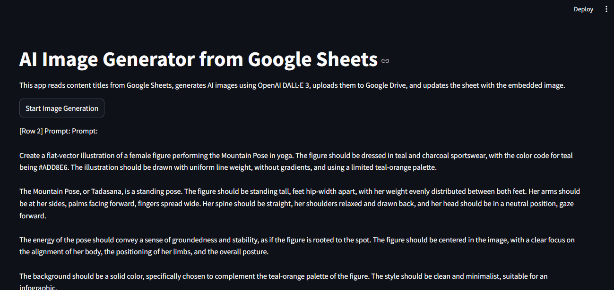
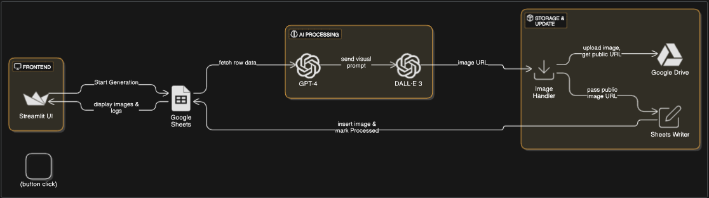

#  AI Image Generator

This project automates the creation of AI-generated illustrations for yoga poses using OpenAI's DALL·E 3, GPT-4, and Google Sheets + Google Drive integration. It reads pose details from a Google Sheet, generates visually enhanced prompts using GPT-4, produces DALL·E 3 images, uploads them to Google Drive, and embeds them back into the sheet using `=IMAGE(...)`.

---

##  Demo



---

##  Architecture



---

##  Tools & Frameworks

| Tool / Framework         | Purpose |
|--------------------------|---------|
| **Python 3.9+**          | Core programming language |
| **Streamlit**            | Interactive frontend UI |
| **OpenAI API**           | GPT-4 (prompt crafting) & DALL·E 3 (image generation) |
| **LangChain**            | Prompt templating |
| **Google Sheets API**    | Read/write pose data & embed images |
| **Google Drive API**     | Host generated images and create shareable links |
| **Pandas**               | Data manipulation |
| **dotenv**               | Manage environment variables |
| **Pillow (PIL)**         | Image file handling |

---

##  AI Models Used

- **GPT-4 (`gpt-4`)** — for intelligently generating DALL·E-compatible prompts that avoid literal misinterpretation and describe yoga poses accurately.
- **DALL·E 3 (`dall-e-3`)** — for generating the actual yoga pose illustrations in flat-vector, infographic-ready style.

---

##  Features

- Reads yoga pose details from Google Sheets
- GPT-4 auto-generates artist-grade prompts
- DALL·E 3 creates pose-accurate images
- Downloads image, uploads to Drive, and embeds it in the sheet
- Shows results live in a Streamlit UI
- Tracks processed rows to avoid duplicate generation

---

##  Setup Instructions

### 1.  Clone the Repo

```bash
git clone https://github.com/your-username/ai-yoga-generator.git
cd ai-yoga-generator
```

### 2.  Create and Activate Virtual Environment

```bash
python -m venv venv
source venv/bin/activate  # On Windows use: venv\Scripts\activate
```

### 3.  Install Dependencies

```bash
pip install -r requirements.txt
```

### 4. 🔐 Set Up Environment Variables

Create a `.env` file in the root directory and add:

```
OPENAI_API_KEY=sk-xxxxxxxxxxxxxxxxxxxxxxxxxxxxx
```

### 5.  Set Up Google APIs

1. Enable:
   - Google Sheets API
   - Google Drive API
2. Create a **Service Account**
3. Share your Google Sheet + Drive folder with the service account email
4. Download the `credentials.json` and place it in your root directory

---

##  Running the App

```bash
streamlit run app.py
```

- Click **"Start Image Generation"**
- Images will generate and appear in:
  - Google Sheet (as inline images)
  - Google Drive (public folder)
  - Streamlit web app

---


